# Supplementary Figures — Brain States Friends

This directory catalogues all supplementary figures (S1–S10) for the manuscript. Each figure is provided as a PNG file under `figures/`, and detailed numerical results and analysis provenance appear in the linked findings documents. Two analyses (ICA convergence diagnostics, S8, and ICA out-of-stimulus recurrence, S10) reside on the orphan `supplements` branch of this repository; their findings links point to that branch on GitHub.

## Catalogue

| Figure | What it shows | Figure file(s) | Findings / source | Branch |
|--------|---------------|----------------|-------------------|--------|
| S1 | Cortical and subcortical surface maps of the top recurring brain states, per subject (six subjects, five states each) | [S01_recurring_state_surface_maps.png](figures/S01_recurring_state_surface_maps.png) | [../findings/05b_recurring_states_visualization.md](../findings/05b_recurring_states_visualization.md) | main |
| S2 | PCA loadings diagnostics for one representative subject: loading heatmap, residual variance, motion-artifact flags, LOSO stability | [S02_pca_loadings.png](figures/S02_pca_loadings.png) | [../findings/03b_pca_loadings.md](../findings/03b_pca_loadings.md) | main |
| S3 | Network-stratified video (DINOv2) decoding depth: per-subject montage testing whether the video depth peak localizes to specific networks (five subjects; sub-06's groups all fell below the minimum-states gate) | [S03_video_peak_depth.png](figures/S03_video_peak_depth.png) | [../findings/08d_transformer_depth.md](../findings/08d_transformer_depth.md) | main |
| S4 | Run-onset negative control for transformer depth decoding: decoding profiles anchored to run boundaries rather than stimulus content | [S04_run_onset_negative_control.png](figures/S04_run_onset_negative_control.png) | [../findings/08d_transformer_depth.md](../findings/08d_transformer_depth.md) | main |
| S5 | Per-layer decoding depth strips for three transformer models (audio A, text B, video C) in the cross-stimulus analysis | [S05_decoding_depth_strips_A.png](figures/S05_decoding_depth_strips_A.png), [_B.png](figures/S05_decoding_depth_strips_B.png), [_C.png](figures/S05_decoding_depth_strips_C.png) | [../findings/08e_transformer_cross_stim_aggregate.md](../findings/08e_transformer_cross_stim_aggregate.md) | main |
| S6 | Cross-stimulus validity: PCA cross-stimulus fit diagnostic (A), within-Friends versus cross-stimulus fit (B), and state presence across stimuli (C) | [S06_cross_stimulus_validity_A.png](figures/S06_cross_stimulus_validity_A.png), [_B.png](figures/S06_cross_stimulus_validity_B.png), [_C.png](figures/S06_cross_stimulus_validity_C.png) | [m10](../findings/m10_05_cross_stimulus_validation.md), [hp](../findings/hp_05_cross_stimulus_validation.md), [pp](../findings/pp_05_cross_stimulus_validation.md) | main |
| S7 | Individual differences in state repertoire and decoding: radar-strip summary across subjects | [S07_individual_differences.png](figures/S07_individual_differences.png) | [../findings/06b_transition_structure.md](../findings/06b_transition_structure.md), [../findings/08d_transformer_depth.md](../findings/08d_transformer_depth.md) | main |
| S8 | ICA convergence diagnostics: K-sweep heatmap (A) and per-state matched absolute correlation (B) | [S08_ica_convergence_A.png](figures/S08_ica_convergence_A.png), [_B.png](figures/S08_ica_convergence_B.png) | [sm_alt_ica_states.md](https://github.com/yibeichan/brain-states-friends/blob/supplements/docs/findings/sm_alt_ica_states.md) | supplements |
| S9 | Network participation profiles of recurring brain states across cortical and subcortical systems | [S09_network_participation.png](figures/S09_network_participation.png) | [../findings/05e_temporal_trend_a4.md](../findings/05e_temporal_trend_a4.md) | main |
| S10 | ICA out-of-stimulus recurrence across three stimuli (Movie10, Harry Potter, Petit Prince): winner-take-all (A) and continuous (B) assignment panels for each stimulus | [S10_ica_oos_recurrence_m10_A_wta.png](figures/S10_ica_oos_recurrence_m10_A_wta.png), [_m10_B.png](figures/S10_ica_oos_recurrence_m10_B_continuous.png), [_hp_A.png](figures/S10_ica_oos_recurrence_hp_A_wta.png), [_hp_B.png](figures/S10_ica_oos_recurrence_hp_B_continuous.png), [_pp_A.png](figures/S10_ica_oos_recurrence_pp_A_wta.png), [_pp_B.png](figures/S10_ica_oos_recurrence_pp_B_continuous.png) | [sm_alt_ica_oos_recurrence.md](https://github.com/yibeichan/brain-states-friends/blob/supplements/docs/findings/sm_alt_ica_oos_recurrence.md) | supplements |

---

## Figure S1 — Recurring state surface maps

For each subject, the five states ranked highest by recurrence score are rendered on both cortical (Schaefer-100 parcels, fsaverage5 surface) and subcortical (CIT168 + HCP atlas meshes) surfaces. States are visualized independently per subject; no cross-subject aggregation was applied. Color scaling uses a symmetric range set to the 95th percentile of absolute z-scores pooled across the five displayed states. Subcortical regions with elevated susceptibility artifact (hippocampus, amygdala) carry lower signal-to-noise and should be interpreted with caution.

---

## Figure S2 — PCA loadings diagnostics

This figure characterizes the per-subject PCA space that the combined HMM consumes. Panels include the loading heatmap across parcels and components, per-parcel residual variance at the production variance threshold, motion-artifact flags for the leading components, and leave-one-season-out stability of residual variance. Subcortical networks (thalamus, hippocampus/amygdala, basal ganglia) showed the highest residual fractions; unimodal cortical networks were nearly fully captured by the retained components. One subject (sub-06) had a flag on a somatomotor-dominant loading; no subject had all motion-artifact criteria exceeded simultaneously.

---

## Figure S3 — Network-stratified video decoding depth (DINOv2)

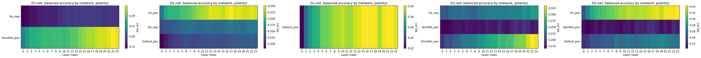

This vision-specific analysis tests whether the DINOv2 video decoding peak localizes to particular brain networks. Each subject contributes one heatmap whose rows are network-by-polarity groups and whose columns are DINOv2-large layers, colored by balanced accuracy; the best lag is fixed at the value from the main depth analysis. Only groups passing the minimum-states and minimum-TR gates are shown, and significance is assessed by Benjamini-Hochberg correction across layers within each group. Sub-06 is absent because all of its network groups fell below the minimum-states gate.

---

## Figure S4 — Run-onset negative control

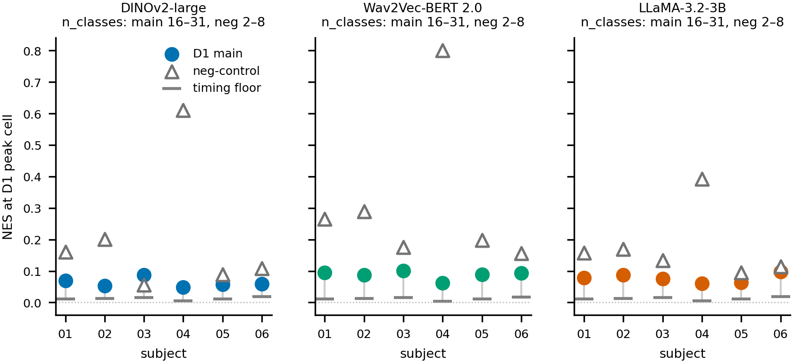

Run-onset-anchored states (those whose fractional occupancy clusters at run or episode boundaries rather than at stimulus content) were used as a negative control to test whether the depth profile reflects content information rather than timing structure. The control profiles confirm that timing-anchored labels produce a pattern distinct from the content-eligible analysis; the main analysis results cannot be attributed to run-boundary confounds. Note that this gate was deprecated for the LLaMA text model because run-onset-anchored states are not content-free for that modality; the confound-baseline comparison is the primary apples-to-apples comparator for all three models.

---

## Figure S5 — Decoding depth strips by modality

**Panel A — Audio (Wav2Vec-BERT 2.0)**

**Panel B — Text (LLaMA-3.2-3B)**
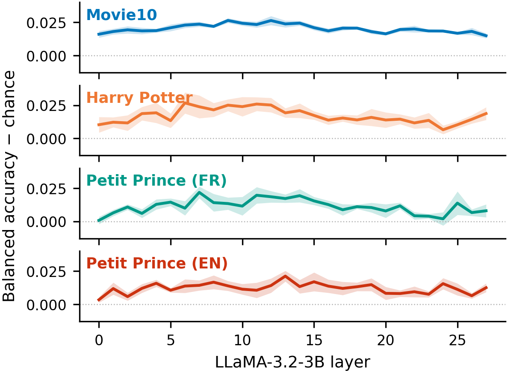

**Panel C — Video (DINOv2-large)**
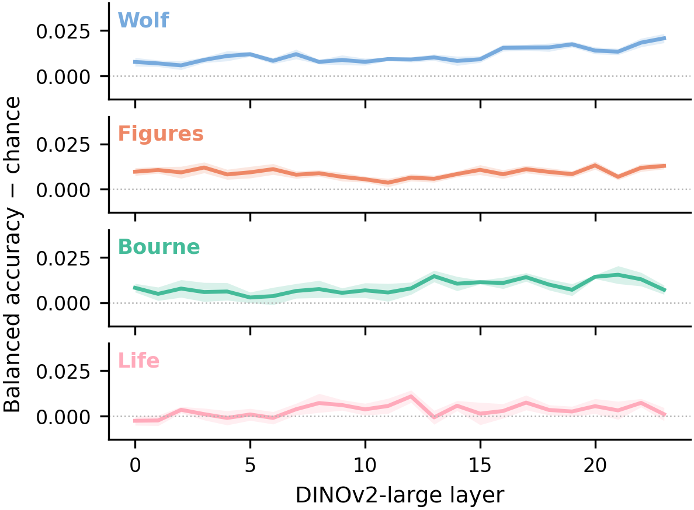

These strips show per-layer decoding accuracy (balanced accuracy minus chance) for the cross-stimulus analysis, in which a Friends-trained classifier is applied without retraining to held-out stimuli. Each panel is one transformer model, and each line within a panel is one held-out stimulus, aggregated across subjects (shaded band). The stimulus set differs by modality: the audio model (A) covers Movie10 and Petit Prince in both languages; the text model (B) adds Harry Potter; the video model (C) covers the four Movie10 films. Cross-stimulus decoding is modest in magnitude relative to within-Friends decoding, consistent with the main cross-stimulus results.

---

## Figure S6 — Cross-stimulus validity

**Panel A — PCA cross-stimulus fit diagnostic**
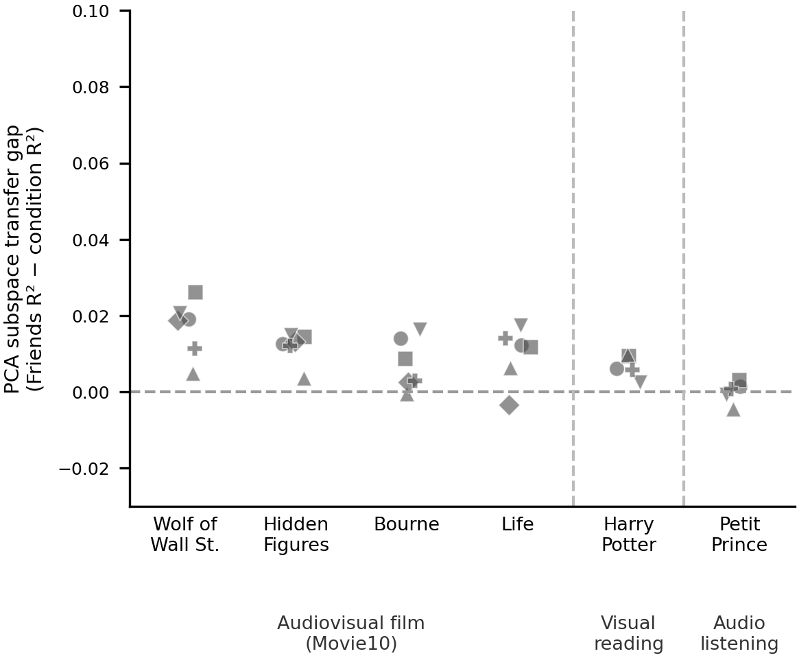

**Panel B — Within-Friends versus cross-stimulus fit**
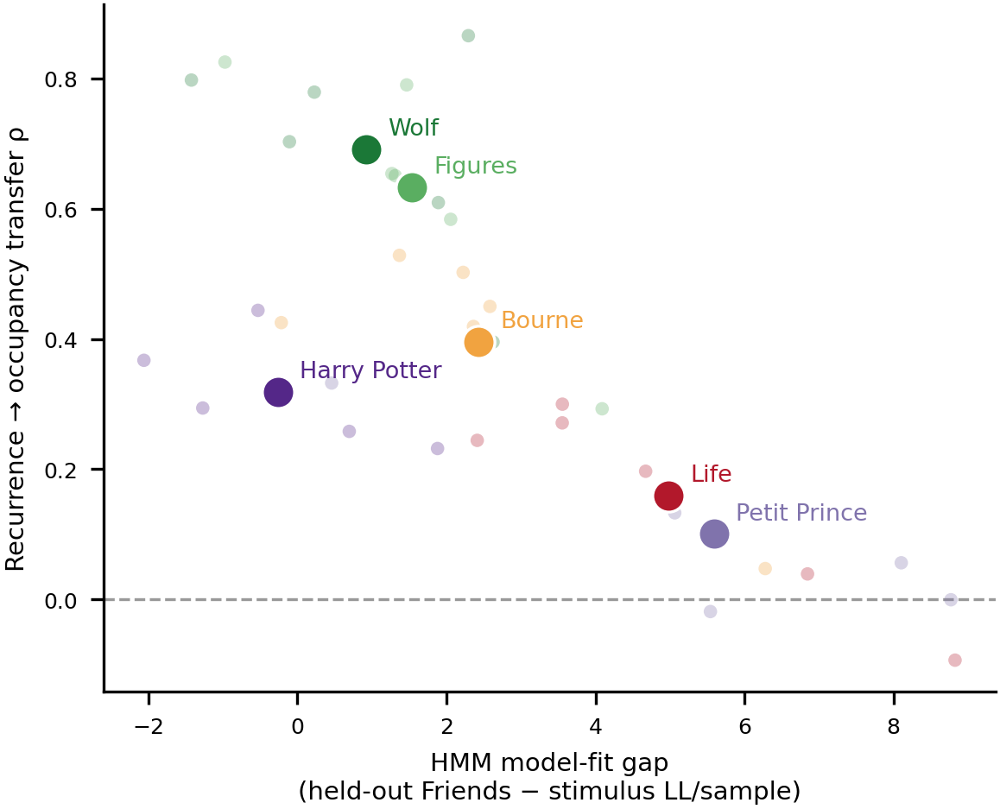

**Panel C — State presence across stimuli**
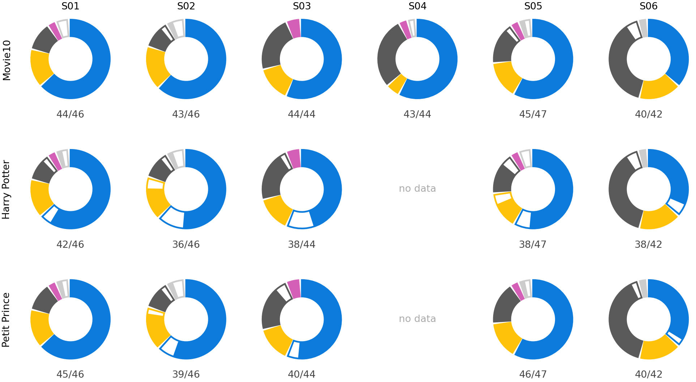

These panels document the cross-stimulus generalization checks. Panel A shows that Friends-trained PCA components explained neocortical variance across Movie10, Harry Potter, and Petit Prince with minimal loss; subcortical networks (thalamus, hippocampus/amygdala) explained less variance out-of-stimulus, consistent with their higher residual variance within Friends. Panel B compares within-Friends HMM fit against cross-stimulus fit. Panel C shows that states active in Friends were also recovered in the held-out stimuli, with no Friends-inactive state gaining appreciable occupancy in any held-out context.

---

## Figure S7 — Individual differences

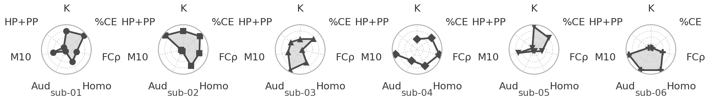

This assembled strip summarizes subject-level variation across multiple analyses: transition graph topology, recurrence-occupancy relationships, and per-modality decoding effect sizes. The panel spans findings documented in the transition-structure analysis (edge count, bidirectionality index, community count, recurrence assortativity) and the transformer-depth analysis (peak layer and normalized effect size per model). Variation across the six subjects was present throughout these measures and is displayed here without cross-subject averaging, consistent with the per-subject analytic design used throughout the manuscript.

---

## Figure S8 — ICA convergence diagnostics

**Panel A — K-sweep heatmap**

**Panel B — Per-state matched absolute correlation**

These panels characterize the ICA decomposition used in the alternative-model supplement. Panel A shows the fraction of FDR-surviving spatially matched ICA–HMM pairs (content-eligible states) across six subjects as a function of the number of ICA components K. Panel B shows the per-state matched absolute correlation (|r|) between ICA consensus maps and HMM state-mean maps at each subject's K_active, with states coloured by HMM taxonomy category. Detailed numerical results are in the findings document on the `supplements` branch (linked in the catalogue table above).

---

## Figure S9 — Network participation

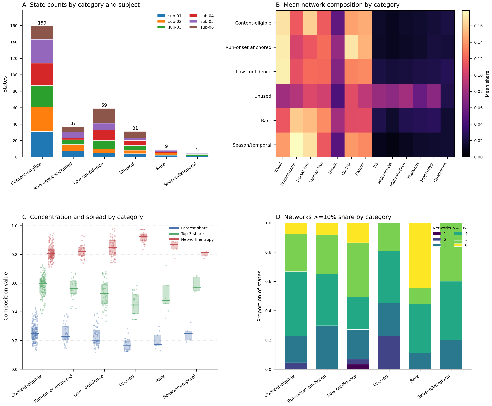

This figure shows how recurring brain states distribute their activation energy across large-scale cortical and subcortical networks, based on the state classification scheme produced by the temporal-trend and eligibility analysis. States classified as eligible for content analysis (those without run-onset anchoring, season-level temporal drift, or low-confidence flags) are displayed alongside informational reference categories. The profile illustrates the network heterogeneity of the recurring state repertoire.

---

## Figure S10 — ICA out-of-stimulus recurrence

**Movie10 — Winner-take-all assignment**
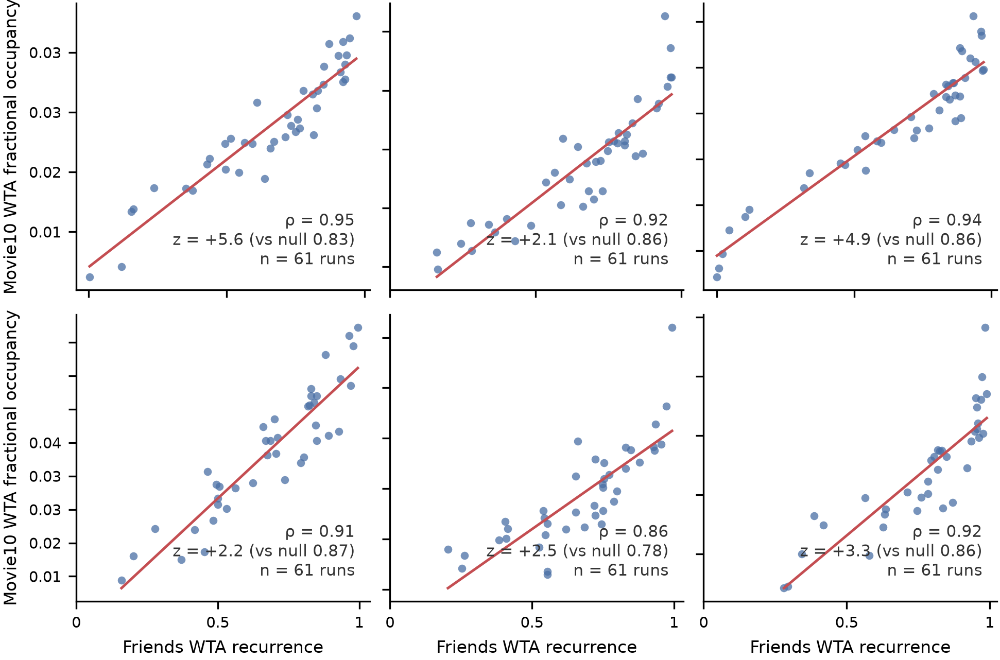

**Movie10 — Continuous assignment**
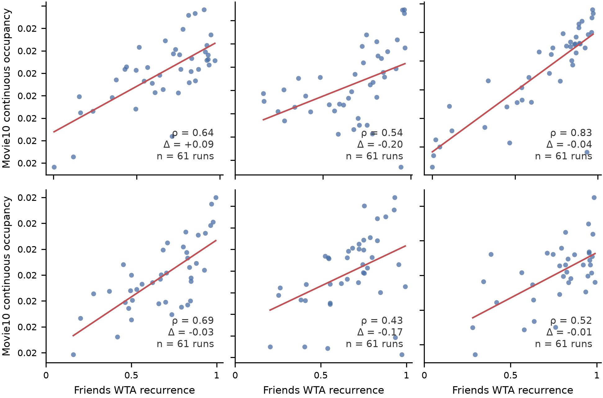

**Harry Potter — Winner-take-all assignment**
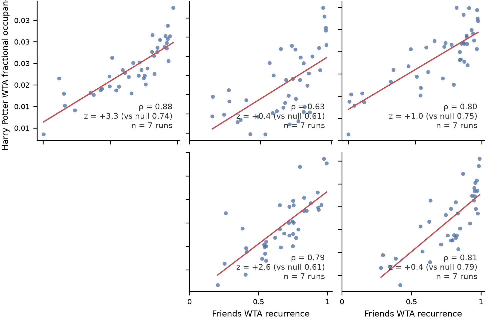

**Harry Potter — Continuous assignment**

**Petit Prince — Winner-take-all assignment**

**Petit Prince — Continuous assignment**

These six panels repeat the out-of-stimulus recurrence test using an ICA-based alternative decomposition in place of the HMM used in the main analysis. Each panel pair presents winner-take-all (hard) and continuous (soft) assignment variants for one held-out stimulus. The three stimuli (Movie10, Harry Potter, and Petit Prince) match those used in the main cross-stimulus recurrence analysis. Detailed numerical results are in the findings document on the `supplements` branch (linked in the catalogue table above).

---

## Note on the `supplements` branch

Figures S8 and S10 derive from analyses run under a separate computational environment maintained on the orphan `supplements` branch of this repository. That branch holds its own `uv`-managed Python project, flat-named findings documents (`sm_alt_ica_states.md`, `sm_alt_ica_oos_recurrence.md`), and rendered outputs; it shares no commit history with `main`. The findings links for S8 and S10 in the catalogue table above point directly to those files on GitHub.
