# Supplementary Figures and Tables — Brain States Friends

This directory catalogues all supplementary figures (S1–S12) for the manuscript. Each figure is provided as a PNG file under `figures/`, and detailed numerical results and analysis provenance appear in the linked findings documents. Two analyses (ICA convergence diagnostics, S10, and ICA out-of-stimulus recurrence, S12) reside on the orphan `supplements` branch of this repository; their findings links point to that branch on GitHub. Supplementary tables are numbered separately and catalogued in [Supplementary Tables](#supplementary-tables) at the end of this document.

## Catalogue

| Figure | What it shows | Figure file(s) | Findings / source | Branch |
|--------|---------------|----------------|-------------------|--------|
| S1 | Cortical and subcortical surface maps of the top recurring brain states, per subject (six subjects, five states each) | [S01_recurring_state_surface_maps.png](figures/S01_recurring_state_surface_maps.png) | [../findings/05b_recurring_states_visualization.md](../findings/05b_recurring_states_visualization.md) | main |
| S2 | PCA loadings diagnostics for one representative subject: loading heatmap, residual variance, motion-artifact flags, LOSO stability | [S02_pca_loadings.png](figures/S02_pca_loadings.png) | [../findings/03b_pca_loadings.md](../findings/03b_pca_loadings.md) | main |
| S3 | HMM model selection: validation log-likelihood against occupied states (A), occupied states against truncation capacity (B), and train-to-validation likelihood gap against capacity (C), per subject | [S03_model_selection_A.png](figures/S03_model_selection_A.png), [_B.png](figures/S03_model_selection_B.png), [_C.png](figures/S03_model_selection_C.png) | [../findings/04_combined_hdphmm.md](../findings/04_combined_hdphmm.md) | main |
| S4 | Within-Friends reliability: matched-pair spatial correlation for LOSO and split-half refits (A), structural invariants across LOSO folds against the 10-seed initialization range (B), and the within-state functional-connectivity arm, raw (C) and mean-removed (D), each against a mismatched-pair null | [S04_reliability_A.png](figures/S04_reliability_A.png), [_B.png](figures/S04_reliability_B.png), [_C.png](figures/S04_reliability_C.png), [_D.png](figures/S04_reliability_D.png) | [04ra](../findings/04ra_loso_struct_comp.md), [04rb](../findings/04rb_split_half_reliability.md), [04rc](../findings/04rc_reliability_fc.md) | main |
| S5 | Network-stratified video (DINOv2) decoding depth: per-subject montage testing whether the video depth peak localizes to specific networks (five subjects; sub-06's groups all fell below the minimum-states gate) | [S05_video_peak_depth.png](figures/S05_video_peak_depth.png) | [../findings/08d_transformer_depth.md](../findings/08d_transformer_depth.md) | main |
| S6 | Run-onset negative control and timing floor at the main decoding peak. Disclosure panel: the control is invalidated by a 2–8 vs 16–31 class-count asymmetry; the class-matched timing floor is the operative comparator and is cleared in all 18 cells | [S06_run_onset_negative_control.png](figures/S06_run_onset_negative_control.png) | [../findings/08d_transformer_depth.md](../findings/08d_transformer_depth.md) | main |
| S7 | Per-layer decoding depth strips for three transformer models (audio A, text B, video C) in the cross-stimulus analysis | [S07_decoding_depth_strips_A.png](figures/S07_decoding_depth_strips_A.png), [_B.png](figures/S07_decoding_depth_strips_B.png), [_C.png](figures/S07_decoding_depth_strips_C.png) | [../findings/08e_transformer_cross_stim_aggregate.md](../findings/08e_transformer_cross_stim_aggregate.md) | main |
| S8 | Cross-stimulus validity, including resting state: PCA cross-stimulus fit diagnostic (A), within-Friends versus cross-stimulus fit (B), and state presence across stimuli (C) | [S08_cross_stimulus_validity_A.png](figures/S08_cross_stimulus_validity_A.png), [_B.png](figures/S08_cross_stimulus_validity_B.png), [_C.png](figures/S08_cross_stimulus_validity_C.png) | [m10](../findings/m10_05_cross_stimulus_validation.md), [hp](../findings/hp_05_cross_stimulus_validation.md), [pp](../findings/pp_05_cross_stimulus_validation.md), [rest](../findings/rest_05_cross_stimulus_validation.md) | main |
| S9 | Individual differences in state repertoire and decoding: radar-strip summary across subjects | [S09_individual_differences.png](figures/S09_individual_differences.png) | [../findings/06b_transition_structure.md](../findings/06b_transition_structure.md), [../findings/08d_transformer_depth.md](../findings/08d_transformer_depth.md) | main |
| S10 | ICA convergence diagnostics: K-sweep heatmap (A) and per-state matched absolute correlation (B) | [S10_ica_convergence_A.png](figures/S10_ica_convergence_A.png), [_B.png](figures/S10_ica_convergence_B.png) | [sm_alt_ica_states.md](https://github.com/yibeichan/brain-states-friends/blob/supplements/docs/findings/sm_alt_ica_states.md) | supplements |
| S11 | Network participation profiles of recurring brain states across cortical and subcortical systems | [S11_network_participation.png](figures/S11_network_participation.png) | [../findings/05e_temporal_trend_a4.md](../findings/05e_temporal_trend_a4.md) | main |
| S12 | ICA out-of-stimulus recurrence across three stimuli (Movie10, Harry Potter, Petit Prince): winner-take-all (A) and continuous (B) assignment panels for each stimulus | [S12_ica_oos_recurrence_m10_A_wta.png](figures/S12_ica_oos_recurrence_m10_A_wta.png), [_m10_B.png](figures/S12_ica_oos_recurrence_m10_B_continuous.png), [_hp_A.png](figures/S12_ica_oos_recurrence_hp_A_wta.png), [_hp_B.png](figures/S12_ica_oos_recurrence_hp_B_continuous.png), [_pp_A.png](figures/S12_ica_oos_recurrence_pp_A_wta.png), [_pp_B.png](figures/S12_ica_oos_recurrence_pp_B_continuous.png) | [sm_alt_ica_oos_recurrence.md](https://github.com/yibeichan/brain-states-friends/blob/supplements/docs/findings/sm_alt_ica_oos_recurrence.md) | supplements |

---

## Figure S1 — Recurring state surface maps

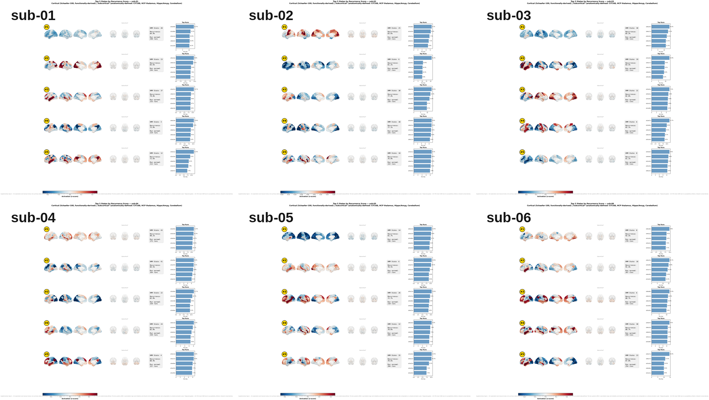

For each subject, the five states ranked highest by recurrence score are rendered on both cortical (Schaefer-100 parcels, fsaverage5 surface) and subcortical (CIT168 + HCP atlas meshes) surfaces. States are visualized independently per subject; no cross-subject aggregation was applied. Color scaling uses a symmetric range set to the 95th percentile of absolute z-scores pooled across the five displayed states. Subcortical regions with elevated susceptibility artifact (hippocampus, amygdala) carry lower signal-to-noise and should be interpreted with caution.

---

## Figure S2 — PCA loadings diagnostics

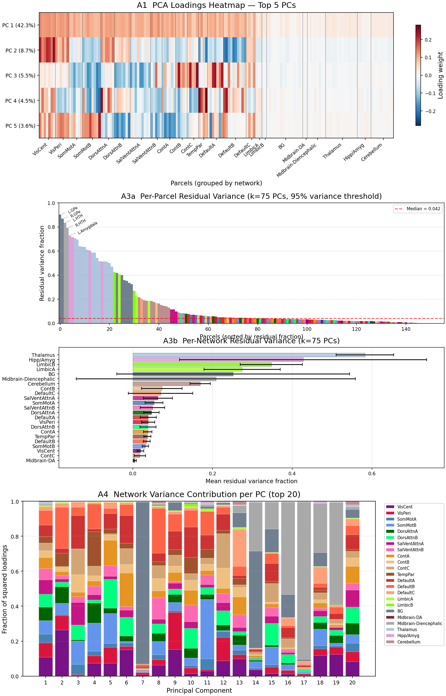

This figure characterizes the per-subject PCA space that the combined HMM consumes. Panels include the loading heatmap across parcels and components, per-parcel residual variance at the production variance threshold, motion-artifact flags for the leading components, and leave-one-season-out stability of residual variance. Subcortical networks (thalamus, hippocampus/amygdala, basal ganglia) showed the highest residual fractions; unimodal cortical networks were nearly fully captured by the retained components. One subject (sub-06) had a flag on a somatomotor-dominant loading; no subject had all motion-artifact criteria exceeded simultaneously.

---

## Figure S3 — HMM model selection

**Panel A — Validation likelihood against occupied states**
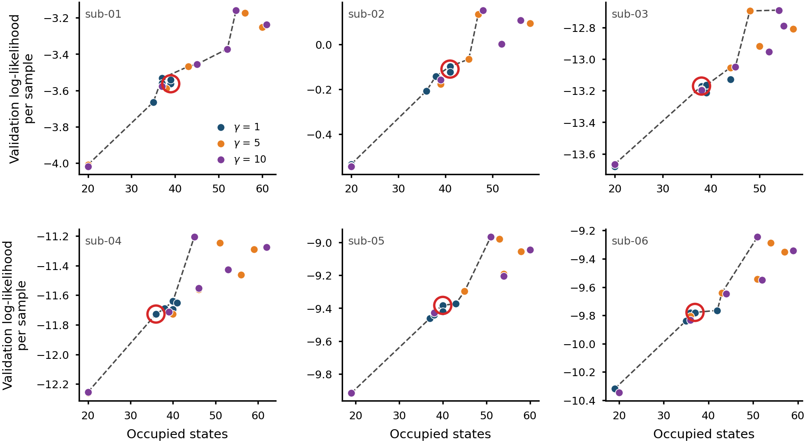

**Panel B — Occupied states against truncation capacity**
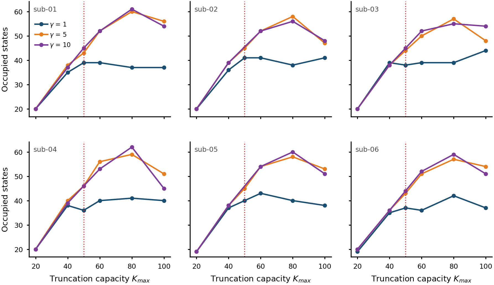

**Panel C — Train-to-validation likelihood gap against capacity**
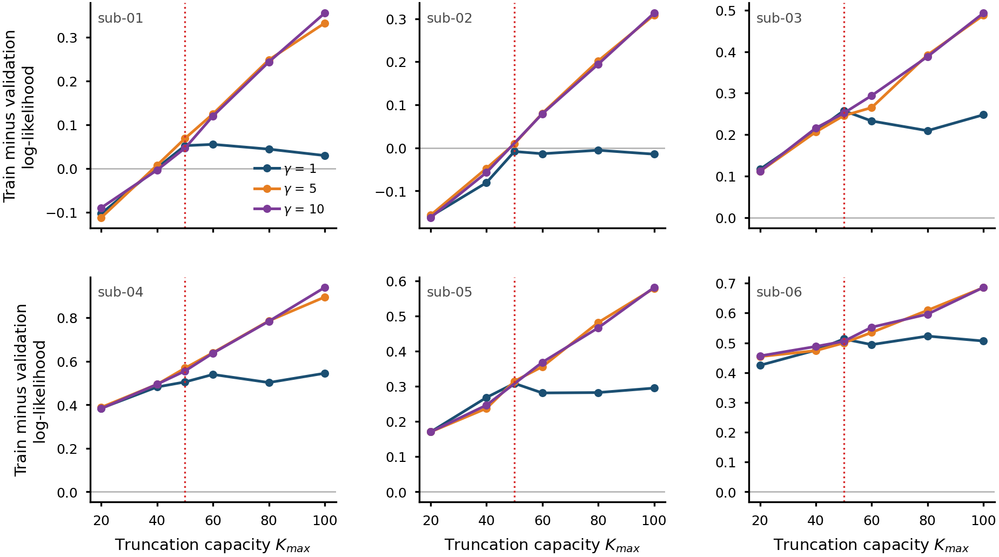

These panels document the configuration choice described in Methods (truncation capacity K_max = 50, concentration γ = 1, sticky bias κ = 10, row concentration α = 1, sticky scale ρ = 1). Each subject contributes its sweep at the production variance threshold (17–18 configurations at vt = 0.95). A state counts as occupied when its final-iteration usage fraction exceeds 0.01. The selected configuration is ringed in Panel A and marked by the dotted line in Panels B and C.

Panel A shows that validation likelihood keeps rising as configurations admit more occupied states, so likelihood alone does not identify a stopping point; the dashed line is the Pareto frontier, the set of configurations for which no alternative achieves both a higher likelihood and fewer occupied states. Panel B shows why capacity alone does not settle the question either: at γ = 1 the occupied count saturates near 35–44 across capacities from 40 to 100, whereas at γ = 5 and γ = 10 it tracks capacity upward to as many as 62 states. The selected configuration is the simplest one inside the saturated γ = 1 cluster.

Two readings require care. Panel A uses a separate y-range per subject, because validation likelihood per sample differs by roughly 10 nats across participants; the panel supports comparison among configurations within a participant, not comparison of fit quality between participants. In Panel C the selected configuration's gap is smaller than that of every higher-capacity configuration at γ = 5 and γ = 10, but it is not smaller than the γ = 1 configurations at capacities 80 and 100 for sub-01, sub-02, and sub-03; the gap advantage should be read within a concentration setting rather than across all higher-capacity models. The sweep is also not the production model: the production model is a 10-seed refit whose active-state counts are 42, 42, 42, 41, 41, and 37 for sub-01 through sub-06.

---

## Figure S4 — Within-Friends reliability

**Panel A — Matched-pair spatial correlation**
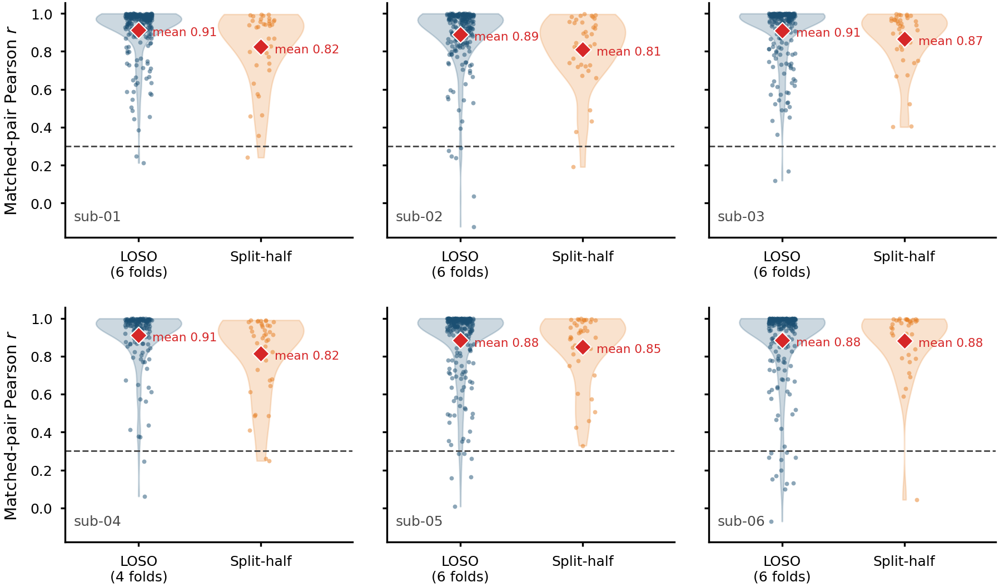

**Panel B — Structural invariants across LOSO folds**
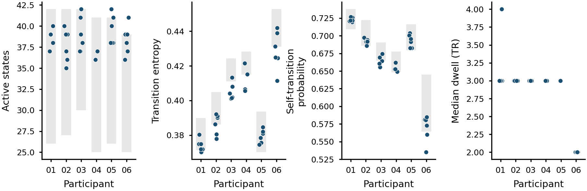

These panels report the two refit procedures described in Methods. Leave-one-season-out (LOSO) refits test whether the repertoire depends on the particular seasons used for fitting; split-half refits partition each subject's episodes by an interleaved odd/even rule and test order-independence. Each refit fits its own PCA on its own training subset, so no held-out data informs the basis. State sets are matched post hoc by the Hungarian algorithm on emission means back-projected to the 156-parcel space.

Panel A is the evidence behind the permissive r > 0.3 matching screen (dashed line). Because the Hungarian algorithm returns a one-to-one pairing for every state, including states with no genuine counterpart, the screen separates substantive matches from forced assignments rather than certifying reproducibility on its own. The distributions sit far above it: mean matched-pair r is 0.88–0.91 across LOSO folds and 0.81–0.88 across split halves, with 94.6–99.1% (LOSO) and 94.9–100% (split-half) of pairs above the screen. The distributions are left-skewed, so the marked mean sits below the median (LOSO medians 0.95–0.99; split-half medians 0.84–0.96). Fold counts differ by subject: sub-04 contributed four seasons and therefore four folds, the others six.

Panel B places fold-to-fold variability on a scale. Each dot is one LOSO fold; the shaded band is the range across 10 random-seed initializations of the primary model. The band is a relative-scale anchor only and is not a confidence interval. For active-state count the seed range is markedly wider than the fold spread, so the repertoire size is more sensitive to EM initialization than to which season is held out. Median Viterbi dwell time carries no band because the seed-variability record covers active-state count, transition entropy, and self-transition probability only.

**Panel C — Within-state FC similarity, raw**
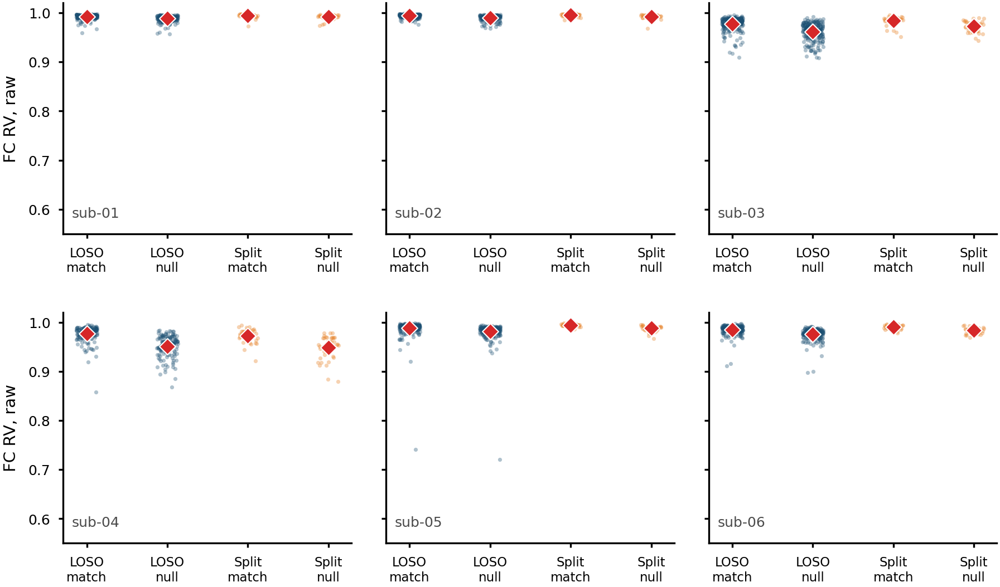

**Panel D — Within-state FC similarity, common mean removed**
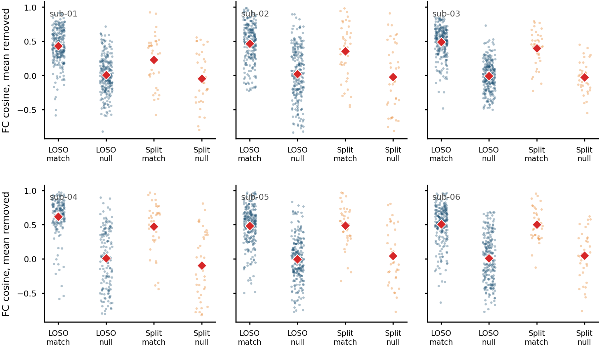

Panels C and D address the caveat that Hungarian matching on mean activation cannot tell whether matched states also share within-state functional connectivity: two states with similar mean maps but different connectivity would be matched anyway. Each panel plots matched pairs alongside a mismatched-pair null, obtained by deranging the target indices so that every comparison is still between two real states from two independent fits. Without that null the arm cannot be interpreted, which is the point of showing both.

Panel C shows that the RV coefficient on the raw connectivity matrices does not do this job. Matched pairs average 0.97–1.00 per participant, which looks like near-perfect reproduction, but mismatched pairs average 0.95–0.99. The difference is 0.002–0.024. Every within-state connectivity matrix is dominated by a component common to all states, so RV is close to its ceiling regardless of whether the two states correspond, and it cannot flag a mean-only match.

Panel D removes that common component by subtracting each fit's across-state mean connectivity before comparing. The arm then separates: matched pairs average 0.23–0.50 while the mismatched null centres near zero (−0.098 to +0.046), a difference of 0.275–0.571 across participants. Matched states therefore do share connectivity structure beyond what all states share, and the matches in Panel A are not mean-only. Panel D reports an unclipped cosine rather than RV, because mean-removed matrices are no longer positive semi-definite and 2.8–23.7% of matched pairs are genuinely negatively similar; RV's clip to the interval [0, 1] would hide those and inflate the null.

The remaining arm described in Methods, the split-half recurrence-rank Spearman correlation (ρ = 0.60–0.82, all p < 1e-4), appears in main Figure 1D.

---

## Figure S5 — Network-stratified video decoding depth (DINOv2)

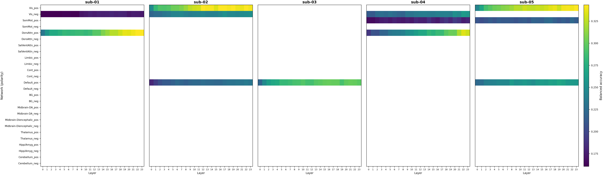

This vision-specific analysis tests whether the DINOv2 video decoding peak localizes to particular brain networks. Each subject contributes one heatmap whose rows are network-by-polarity groups and whose columns are DINOv2-large layers, colored by balanced accuracy; the best lag is fixed at the value from the main depth analysis. Only groups passing the minimum-states and minimum-TR gates are shown, and significance is assessed by Benjamini-Hochberg correction across layers within each group. Sub-06 is absent because all of its network groups fell below the minimum-states gate.

---

## Figure S6 — Run-onset negative control and timing floor

Each panel is one transformer model. For every participant, three quantities are plotted at the cell (lag, layer) where the main content-eligible analysis peaks: the main normalized effect size, the run-onset-anchored negative control, and the timing floor from the six timing and session-position regressors. The grey connector spans the timing floor and the main value.

This panel is reported to disclose a failed control, not to support one. Run-onset-anchored states were intended as a negative control on the reasoning that occupancy clustered at run or episode boundaries carries timing rather than content information. The control does not work, and the figure shows why. Its normalized effect size exceeds the main analysis in 17 of the 18 participant-by-model cells (the exception is DINOv2 in sub-03, 0.087 against 0.056). That advantage is a class-count artifact rather than evidence about content: the control scores 2–8 classes where the main analysis scores 16–31, and normalized effect size is not comparable across different class counts. Sub-04 is the clearest case, with two control classes and a control effect size of 0.61–0.80 against a main value of 0.049–0.061. The label set is also heterogeneous, pooling run-common, a-anchored, and b-anchored states, and the a-anchored subcategory is contaminated by the stereotyped Friends theme song. A class-count-matched redesign is specified but has not been run.

The operative comparison is therefore the timing floor, which is matched to the main analysis in class count and is cleared by the main effect size in all 18 cells (main 0.049–0.101 against floor 0.004–0.018). Read this figure as establishing that comparison and retiring the run-onset control, not as a second line of evidence.

---

## Figure S7 — Decoding depth strips by modality

**Panel A — Audio (Wav2Vec-BERT 2.0)**
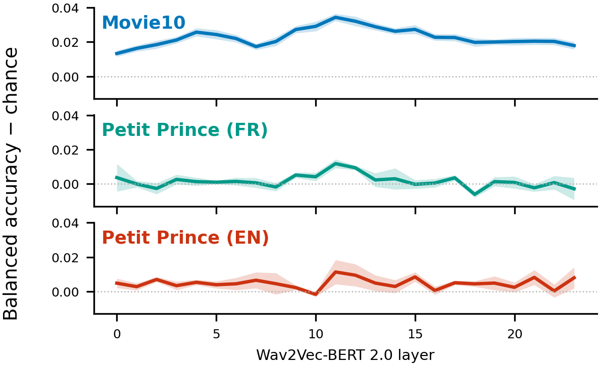

**Panel B — Text (LLaMA-3.2-3B)**
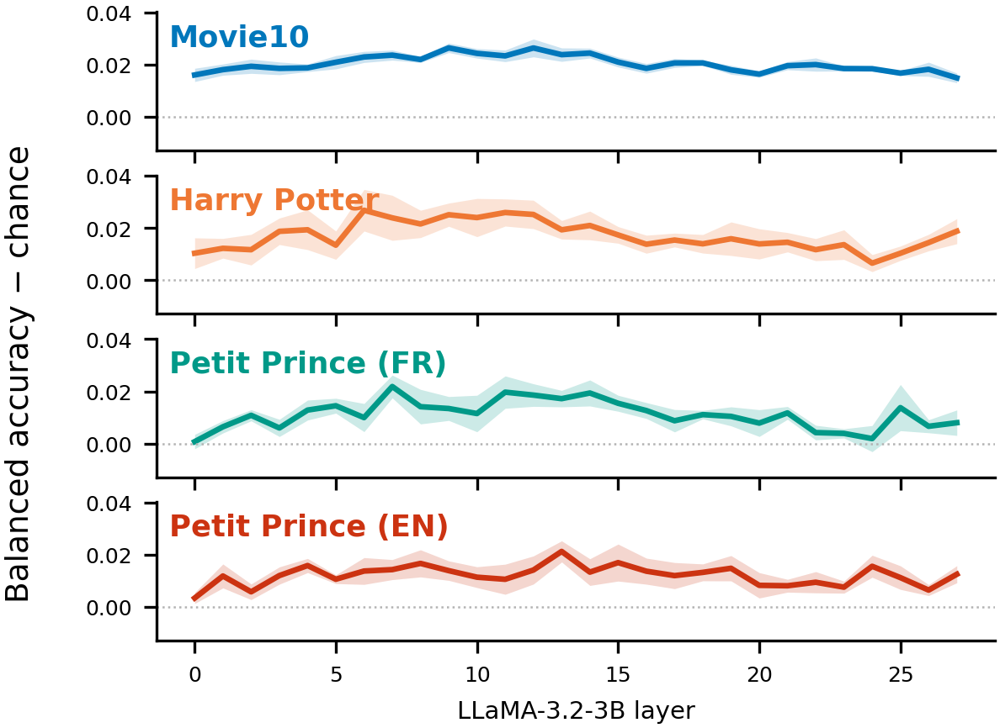

**Panel C — Video (DINOv2-large)**
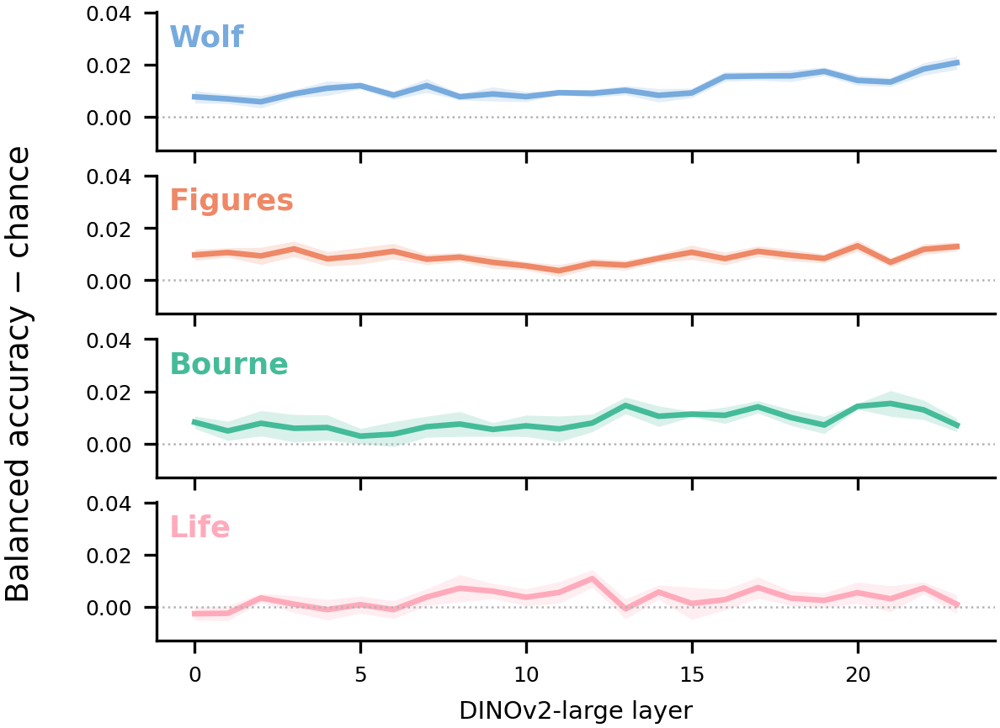

These strips show per-layer decoding accuracy (balanced accuracy minus chance) for the cross-stimulus analysis, in which a Friends-trained classifier is applied without retraining to held-out stimuli. Each panel is one transformer model, and each line within a panel is one held-out stimulus, aggregated across subjects (shaded band). The stimulus set differs by modality: the audio model (A) covers Movie10 and Petit Prince in both languages; the text model (B) adds Harry Potter; the video model (C) covers the four Movie10 films. Cross-stimulus decoding is modest in magnitude relative to within-Friends decoding, consistent with the main cross-stimulus results.

---

## Figure S8 — Cross-stimulus validity

**Panel A — PCA cross-stimulus fit diagnostic**
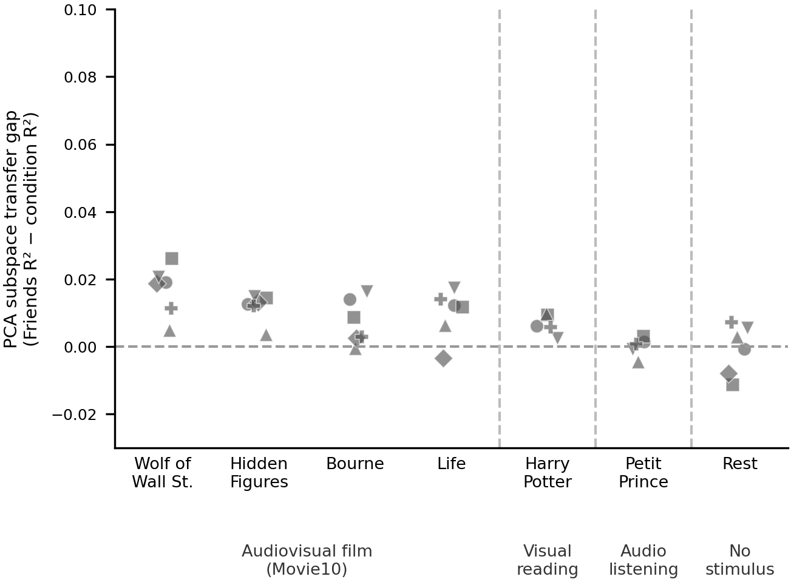

**Panel B — Within-Friends versus cross-stimulus fit**
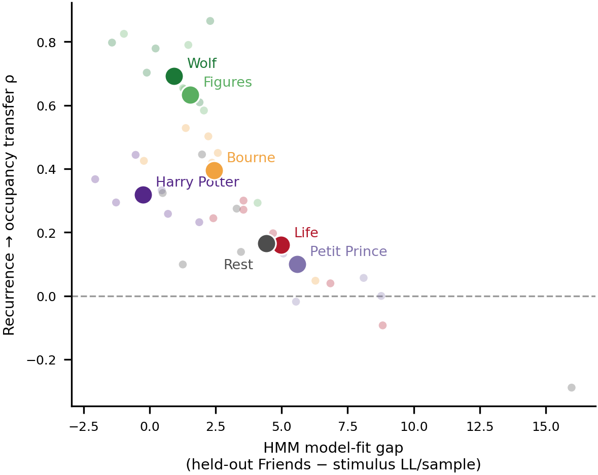

**Panel C — State presence across stimuli**
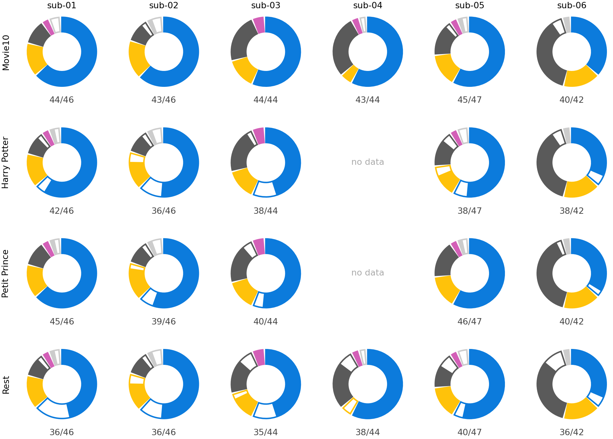

These panels document the cross-stimulus validity checks. Panel A shows that Friends-trained PCA components explained neocortical variance across Movie10, Harry Potter, and Petit Prince with minimal loss; subcortical networks (thalamus, hippocampus/amygdala) explained less variance out-of-stimulus, consistent with their higher residual variance within Friends. Panel B compares within-Friends HMM fit against cross-stimulus fit. Panel C shows that states active in Friends were also recovered in the held-out stimuli, with no Friends-inactive state gaining appreciable occupancy in any held-out context.

Resting state appears in all three panels and is reported here only; it is not part of main Figure 4. All six subjects contributed resting-state data, unlike Harry Potter and Petit Prince, which lack sub-04. The Friends-trained subspace reconstructed rest about as well as it reconstructed the narrative conditions (rest R² 0.943–0.962; per-subject transfer gaps −0.011 to +0.007, Panel A), so the subspace is not stimulus-specific. Temporal fit behaved differently: the held-out-Friends-minus-rest log-likelihood gap spanned 0.49–15.98 per sample, the widest range of any condition, with sub-01 the extreme case (gap 15.98, negative recurrence correspondence). Recurrence correspondence across subjects was ρ = −0.289, 0.324, 0.138, 0.099, 0.274, and 0.445 for sub-01 through sub-06, with two of six reaching uncorrected p < 0.05 (sub-02 p = 0.028; sub-06 p = 0.003). No surrogate null was run for rest, so all rest values are descriptive. Rest's mean ρ (0.165) is not lower than Petit Prince's (0.101), which is expected because raw ρ carries a stimulus-independent covariance and stationarity floor; orderings among the weak conditions are confounded with fit, language, and modality and should not be read as a specificity gradient.

---

## Figure S9 — Individual differences

This assembled strip summarizes subject-level variation across multiple analyses: transition graph topology, recurrence-occupancy relationships, and per-modality decoding effect sizes. The panel spans findings documented in the transition-structure analysis (edge count, bidirectionality index, community count, recurrence assortativity) and the transformer-depth analysis (peak layer and normalized effect size per model). Variation across the six subjects was present throughout these measures and is displayed here without cross-subject averaging, consistent with the per-subject analytic design used throughout the manuscript.

---

## Figure S10 — ICA convergence diagnostics

**Panel A — K-sweep heatmap**
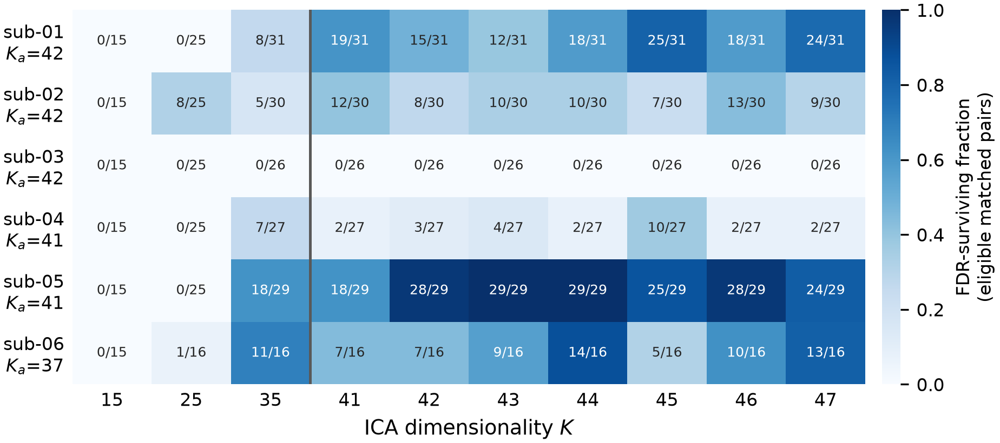

**Panel B — Per-state matched absolute correlation**
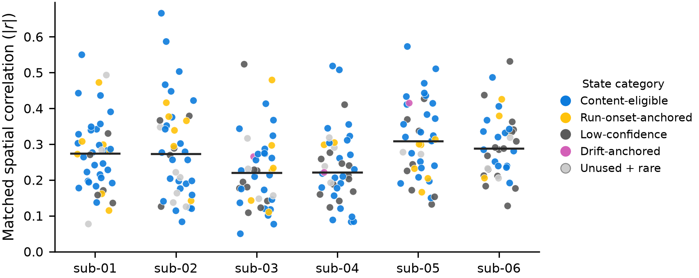

These panels characterize the ICA decomposition used in the alternative-model supplement. Panel A shows the fraction of FDR-surviving spatially matched ICA–HMM pairs (content-eligible states) across six subjects as a function of the number of ICA components K. Panel B shows the per-state matched absolute correlation (|r|) between ICA consensus maps and HMM state-mean maps at each subject's K_active, with states coloured by HMM taxonomy category. Detailed numerical results are in the findings document on the `supplements` branch (linked in the catalogue table above).

---

## Figure S11 — Network participation

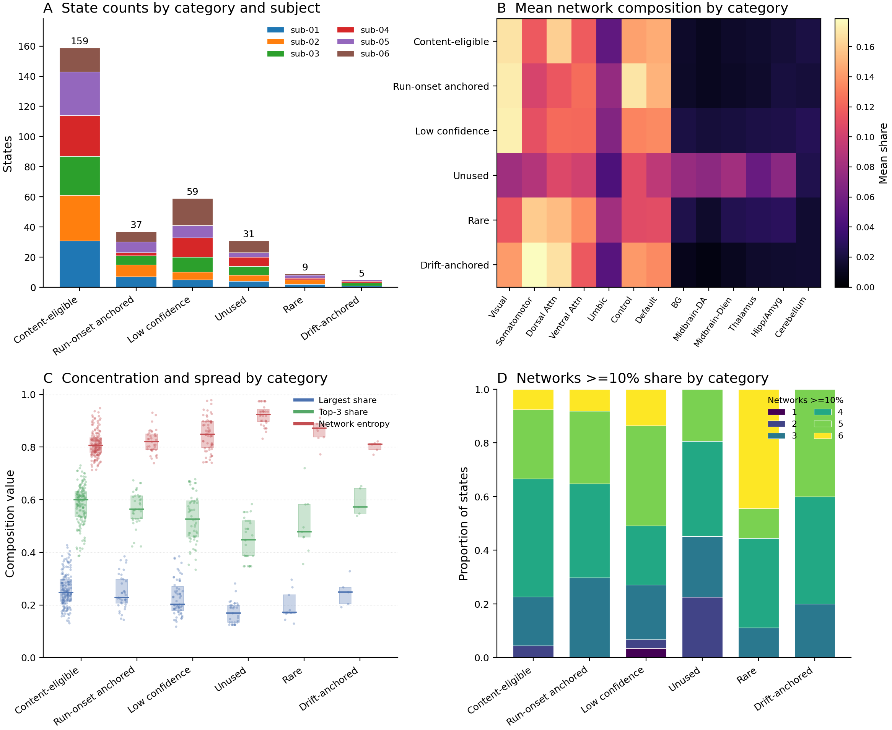

This figure shows how recurring brain states distribute their activation energy across large-scale cortical and subcortical networks, based on the state classification scheme produced by the temporal-trend and eligibility analysis. States classified as eligible for content analysis (those without run-onset anchoring, season-level temporal drift, or low-confidence flags) are displayed alongside informational reference categories. The profile illustrates the network heterogeneity of the recurring state repertoire.

---

## Figure S12 — ICA out-of-stimulus recurrence

**Movie10 — Winner-take-all assignment**

**Movie10 — Continuous assignment**

**Harry Potter — Winner-take-all assignment**

**Harry Potter — Continuous assignment**
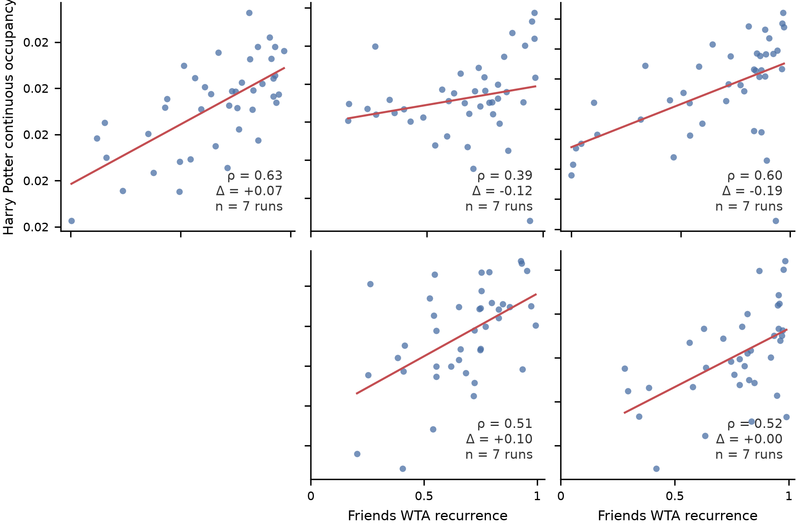

**Petit Prince — Winner-take-all assignment**
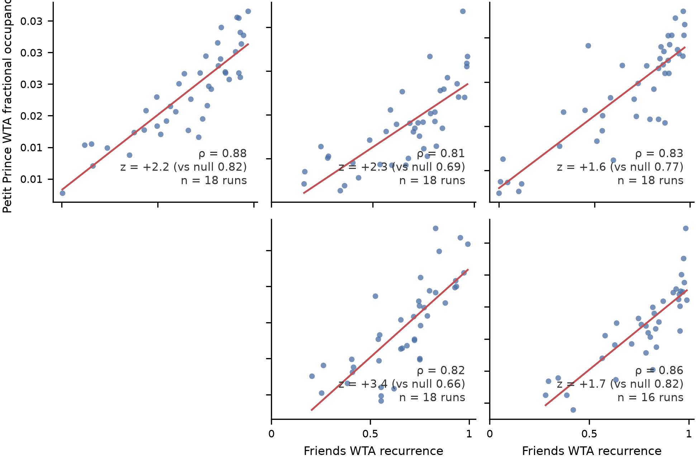

**Petit Prince — Continuous assignment**
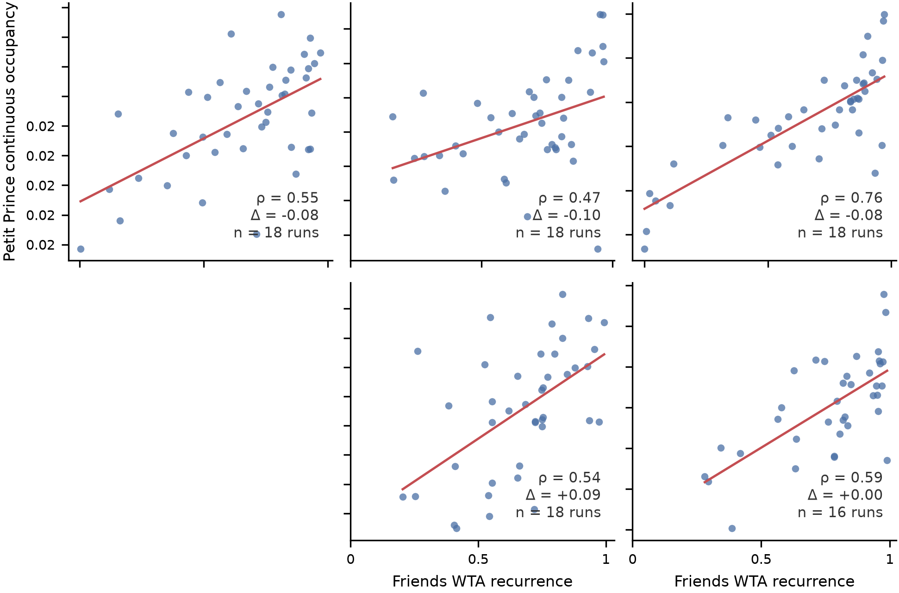

These six panels repeat the out-of-stimulus recurrence test using an ICA-based alternative decomposition in place of the HMM used in the main analysis. Each panel pair presents winner-take-all (hard) and continuous (soft) assignment variants for one held-out stimulus. The three stimuli (Movie10, Harry Potter, and Petit Prince) match those used in the main cross-stimulus recurrence analysis. Detailed numerical results are in the findings document on the `supplements` branch (linked in the catalogue table above).

Two caveats govern how these panels should be read. First, the ICA recurrence score is not on the same footing as the HMM recurrence score used in the main analysis: winner-take-all labelling imposes no dwell structure, so nearly every component exceeds the 2% per-run activity threshold in nearly every run. ICA component recurrence is correspondingly compressed toward the ceiling (per-subject median 0.71–0.82, with 20% of components above 0.9) relative to HMM state recurrence (per-subject median 0.45–0.51, with 3 of 269 states above 0.9). The two distributions are both continuous and broadly graded, but they are not interchangeable, and the ICA panels should not be read as reproducing the main recurrence gradient. Second, the continuous-assignment panels are reported for completeness only: against the phase-randomized null the continuous-arm residual is near zero or negative, so that arm carries no reliable stimulus-specific signal and does not corroborate the winner-take-all result.

---

## Note on the `supplements` branch

Figures S10 and S12 derive from analyses run under a separate computational environment maintained on the orphan `supplements` branch of this repository. That branch holds its own `uv`-managed Python project, flat-named findings documents (`sm_alt_ica_states.md`, `sm_alt_ica_oos_recurrence.md`), and rendered outputs; it shares no commit history with `main`. The findings links for S10 and S12 in the catalogue table above point directly to those files on GitHub.

---

## Supplementary Tables

Supplementary tables are numbered separately from supplementary figures.

| Table | What it shows | Findings / source | Branch |
|-------|---------------|-------------------|--------|
| S1 | Random-direction null for the network-spread index of content-eligible state maps, per participant | [sm_rel_r2_network_spread.md](https://github.com/yibeichan/brain-states-friends/blob/supplements/docs/findings/sm_rel_r2_network_spread.md) | supplements |

### Table S1 — Random-direction null for the network-spread index

Random-direction null for the network-spread index, per participant (10,000 draws; two-sided empirical p floor 0.0002; vm = variance-matched, iso = equal-weight). The network-spread index is the Shannon entropy of a state's 13-network composition normalized by log(13), so 0 means all weight in one network and 1 means weight spread evenly across networks.

| Participant | Eligible states | Observed spread | vm null median [95% CI] | vm z | iso null median | iso z | Observed top-1 share | vm null top-1 (z) |
|---|---|---|---|---|---|---|---|---|
| sub-01 | 31 | 0.793 | 0.927 [0.918, 0.937] | -27.1 | 0.954 | -43.9 | 0.256 | 0.168 (+14.1) |
| sub-02 | 30 | 0.818 | 0.933 [0.924, 0.942] | -25.6 | 0.954 | -37.9 | 0.249 | 0.163 (+14.4) |
| sub-03 | 26 | 0.801 | 0.925 [0.914, 0.935] | -22.6 | 0.957 | -39.7 | 0.243 | 0.171 (+10.4) |
| sub-04 | 27 | 0.788 | 0.921 [0.910, 0.931] | -25.0 | 0.948 | -42.3 | 0.253 | 0.171 (+11.9) |
| sub-05 | 29 | 0.825 | 0.933 [0.923, 0.942] | -21.9 | 0.958 | -37.0 | 0.241 | 0.164 (+12.0) |
| sub-06 | 16 | 0.806 | 0.932 [0.919, 0.944] | -19.3 | 0.956 | -30.2 | 0.230 | 0.164 (+7.8) |

Fitted states were more network-concentrated than random directions in every participant and under both null variants. Observed spread ranged 0.79 to 0.83 across participants, against variance-matched null medians of 0.92 to 0.93 (z = -19 to -27) and equal-weight null medians of 0.95 to 0.96 (z = -30 to -44), with the observed largest-network share correspondingly above the null (0.23 to 0.26 versus about 0.17); the two-sided empirical p reached the 10,000-draw floor of 0.0002 in every participant. Pooled across the 159 content-eligible states, the observed spread index was 0.807 against a variance-matched null median of 0.929 (95% interval 0.924 to 0.933; z = -57.2).

The comparison holds the participant's retained principal-component subspace fixed and redraws directions within it, so it tests whether the multi-network composition of the fitted states is inherited from the principal-component basis. It is not: the fitted states are substantially more network-structured than arbitrary patterns in the same subspace, while still drawing on several networks each.

**Provenance.** Generated by `script/sm_rel_r2_network_spread.py` on the orphan `supplements` branch; per-participant values read from `$SCRATCH_DIR/output/sm_rel_r2_network_spread/atlas-4S156Parcels//vt0.95/r2_network_spread_summary.json` and the pooled row from `pooled_summary.json` in the same tree. The observed per-participant spread values reproduce the independently computed per-subject medians in `fig2_C_network_participation_summary.json` (Figure 2C pipeline) exactly.
